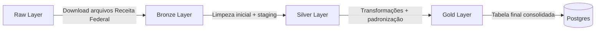

# Stone Data Engineer Challenge

Este projeto tem como objetivo a construção de um **pipeline de ingestão, tratamento e persistência de dados do CNPJ (Empresas e Sócios) da Receita Federal** em um banco de dados **PostgreSQL**, utilizando **Docker, Jupyter Lab e Polars**.

---

## 📂 Estrutura de Pastas

```
├── data/                # Armazena os arquivos em diferentes camadas (raw, bronze, silver, gold)
│   ├── raw/
│   ├── bronze/
│   ├── silver/
│   └── gold/
├── src/                 # Notebooks de cada camada do pipeline
│   ├── raw.ipynb
│   ├── stg_bronze.ipynb
│   ├── stg_silver.ipynb
│   └── stg_gold.ipynb
├── .env.exemple         # Exemplo de configuração de variáveis de ambiente
├── docker-compose.yml   # Configuração do ambiente Docker (Postgres + Jupyter Lab)
├── requirements.txt     # Dependências do projeto
└── README.md
```

---

## ⚙️ Pré-requisitos

- [Docker](https://docs.docker.com/get-docker/) instalado  
- [Docker Compose](https://docs.docker.com/compose/) instalado  

---

## 🚀 Como rodar o projeto

### 1. Clonar o repositório
```bash
git clone https://github.com/seu-usuario/seu-repo.git
cd seu-repo
```

### 2. Configurar variáveis de ambiente
Crie o arquivo `.env` na raiz do projeto (baseado no `.env.exemple`):

```env
DB_HOST=db
DB_PORT=5432
DB_NAME=stone
DB_USER=stone
DB_PASSWORD=stone
```

### 3. Subir os containers
```bash
docker-compose up -d
```

Isso irá iniciar:
- **Postgres** na porta `5432`  
- **Jupyter Lab** na porta `8888`  

Acesse: [http://localhost:8888](http://localhost:8888)

---

## 📊 Pipeline de Dados

1. **Raw Layer (`raw.ipynb`)**  
   - Faz download dos arquivos de **Empresas** e **Sócios** diretamente do site da Receita Federal  
   - Salva os `.zip` em `data/raw`  
   - Extrai os arquivos `.EMPRECSV` e `.SOCIOCSV`

2. **Bronze Layer (`stg_bronze.ipynb`)**  
   - Lê os arquivos **Raw**  
   - Salva arquivos temporários em `data/bronze`  
   - Cria as tabelas no Postgres:  
     - `stg_empresas_bronze`  
     - `stg_socios_bronze`

3. **Silver Layer (`stg_silver.ipynb`)**  
   - Lê dados das tabelas **Bronze**  
   - Realiza **limpeza, tipagem e seleção de colunas**  
   - Remove duplicatas e sanitiza campos  
   - Cria as tabelas no Postgres:  
     - `stg_empresas_silver`  
     - `stg_socios_silver`

4. **Gold Layer (`stg_gold.ipynb`)**  
   - Seleciona colunas de interesse:  
     - `cnpj` (string)  
     - `qtde_socios` (int)  
     - `flag_socio_estrangeiro` (boolean)  
     - `doc_alvo` (boolean)  
   - Cria tabela final no Postgres:  
     - `prd_empresas_socios_gold`

---

## 🔄 Fluxo do Pipeline



---

## 📦 Dependências

As dependências estão listadas em `requirements.txt`:

- pandas  
- polars  
- psycopg2-binary  
- sqlalchemy  
- requests  
- python-dotenv  
- tqdm  
- jupyterlab  

---

## 🛠️ Comandos úteis

- Ver logs do Postgres:
  ```bash
  docker logs stone_db
  ```

- Acessar Postgres via psql:
  ```bash
  docker exec -it stone_db psql -U stone -d stone
  ```

- Derrubar containers:
  ```bash
  docker-compose down
  ```

---

## 📌 Observações

- Os arquivos da Receita Federal são **grandes** → recomenda-se rodar em máquina com boa memória RAM.  
- Caso queira apenas testar, utilize uma **amostra menor de dados** para validar o pipeline.  
